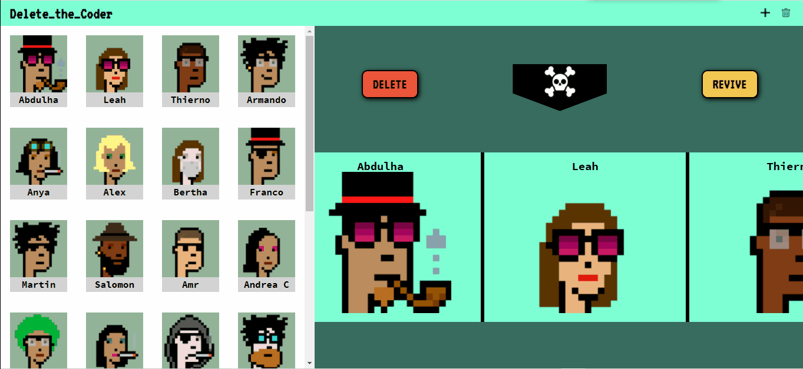
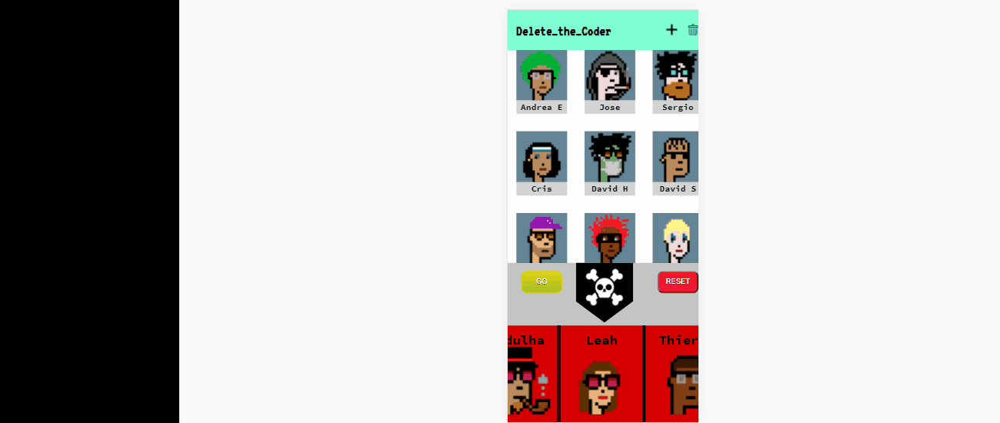
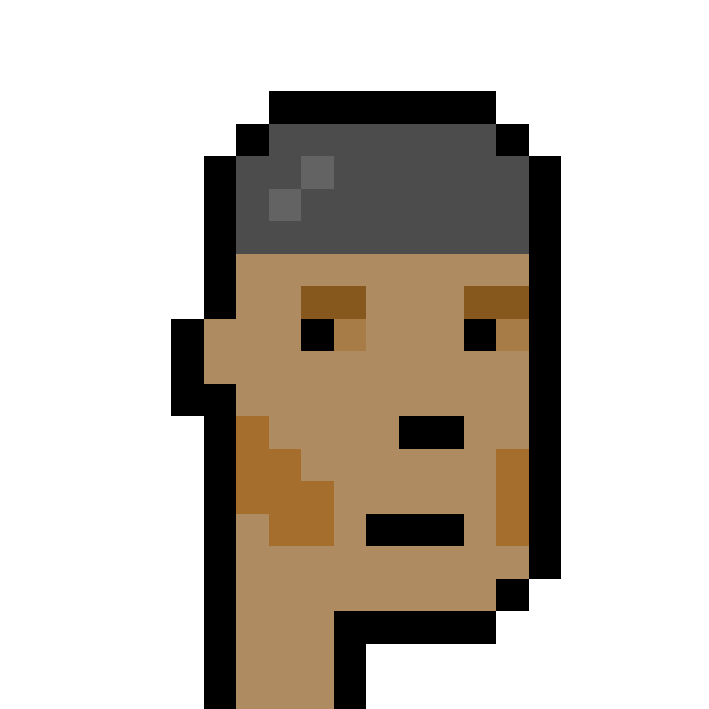
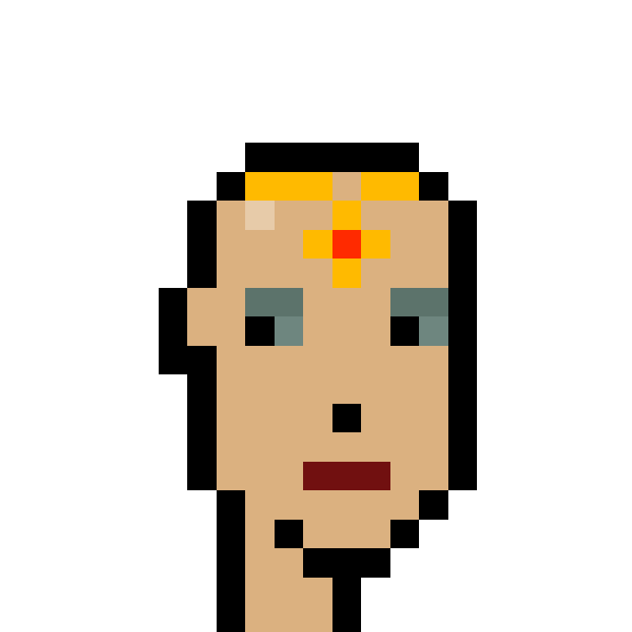
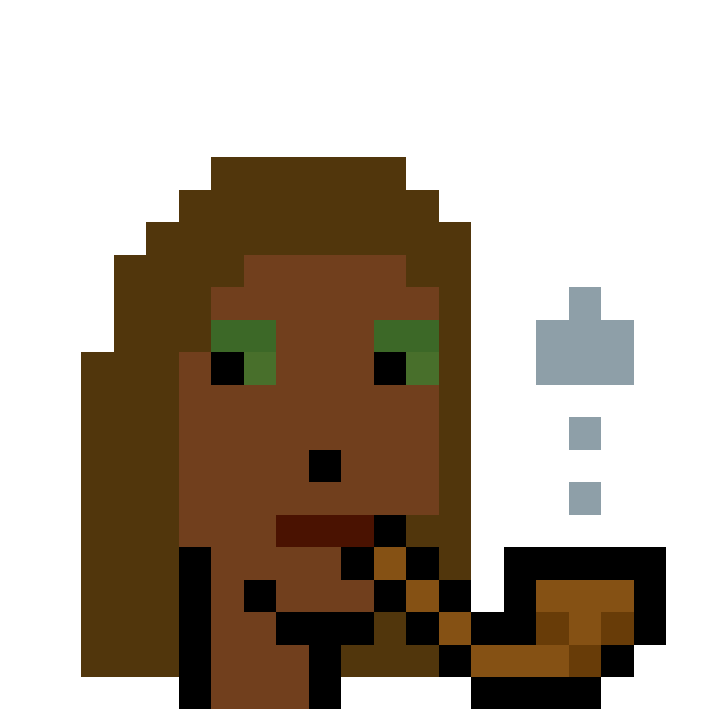
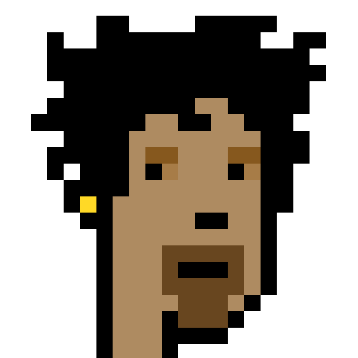

## BIENVENIDO A NUESTRO TERCERCO  PROJECTO DE LOREM:B ☠️
## Wheel-Of-Doom tercero-projecto-fullstack-factoria-f5

Debes tener instalado composer una vez hayas clonado, posteriormente ejecutar el comando:
*Composer install

### Introdución
#### Wheel-of-doom nace debido del nuestro replica de trabajo de grupo en la formación factoria f5 A dónde puedes jugar con la ruleta random que van a matar a cada persona a cada vez que se para puedes añadir mienbros y quitar es una juego muy divertido para hacer una selección de equipos o entre amigos aqui esta nuestra github page click  [Aqui](https://armun4.github.io/Wheel-Of-Doom/ "Aqui")
  

#### al presionar la rueda eliminar mató a una persona de la lista en modo aleatorio al azar acoompagne de una música de la muerte puede agregar miembros y eliminarlos cambiar la foto que desee y adaptar a todos los dispositivos

## Haramientas 
#### Html Css Javascipt Fizzbuzz Trello poker pinks 
hemos usado @Trello para ordenar nuestro trabajo y tamnien pra asignar tareas tenemos una html simple y un @javascript dinamico 
### Equipo
### somos @LOREM:B
### MIENBROS 
###  Amando Mago 
### Leah calafell  
### Abdulha sharif  
### Anya Kholodenko 
###  Thierno Diallo 

